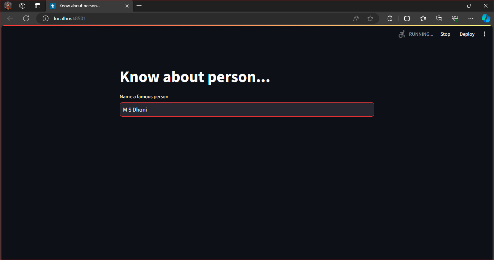
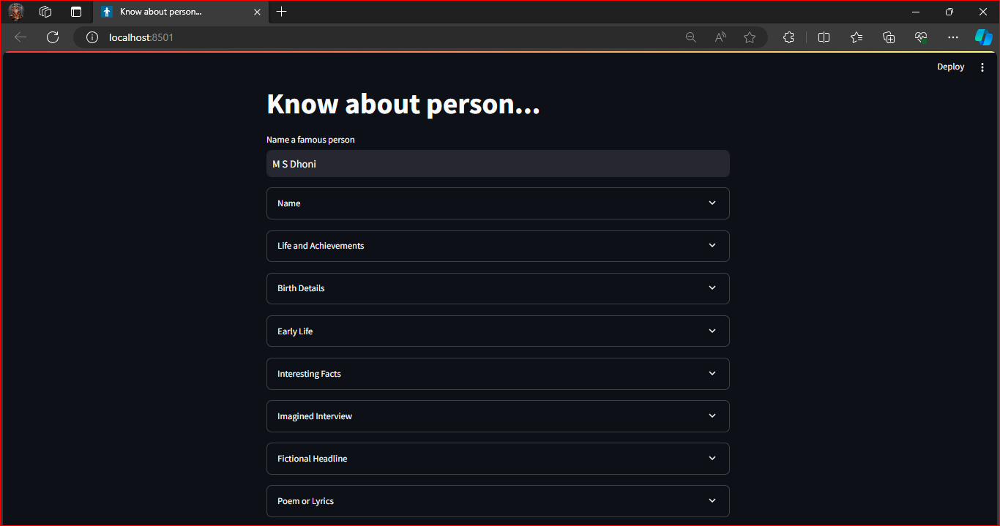
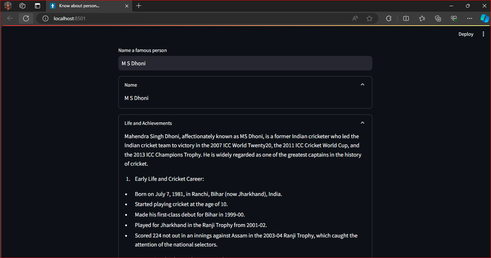
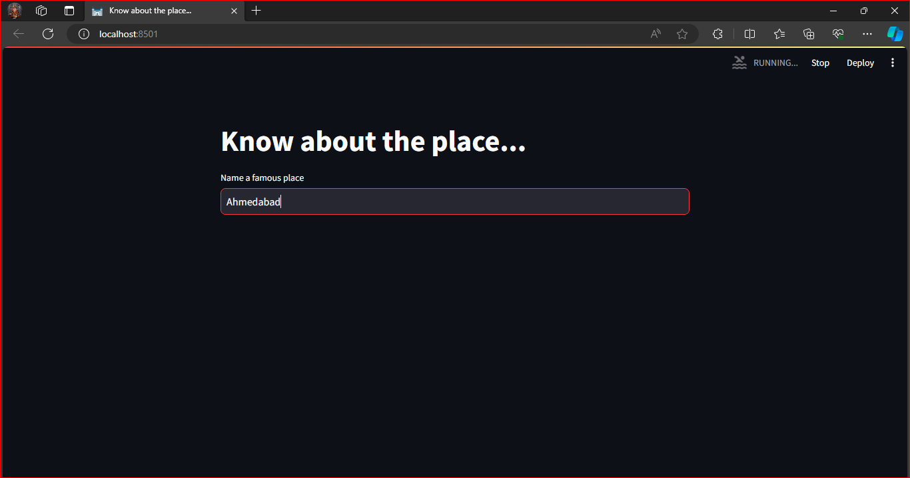
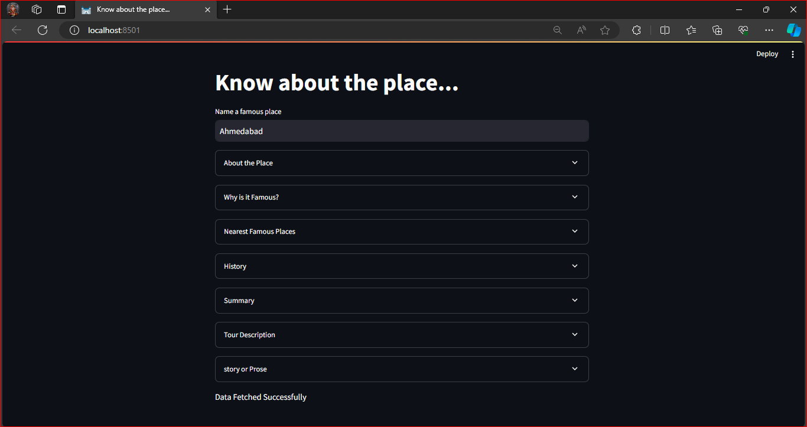
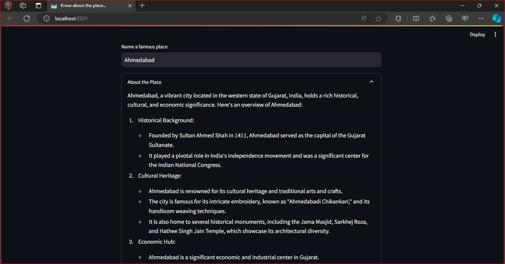
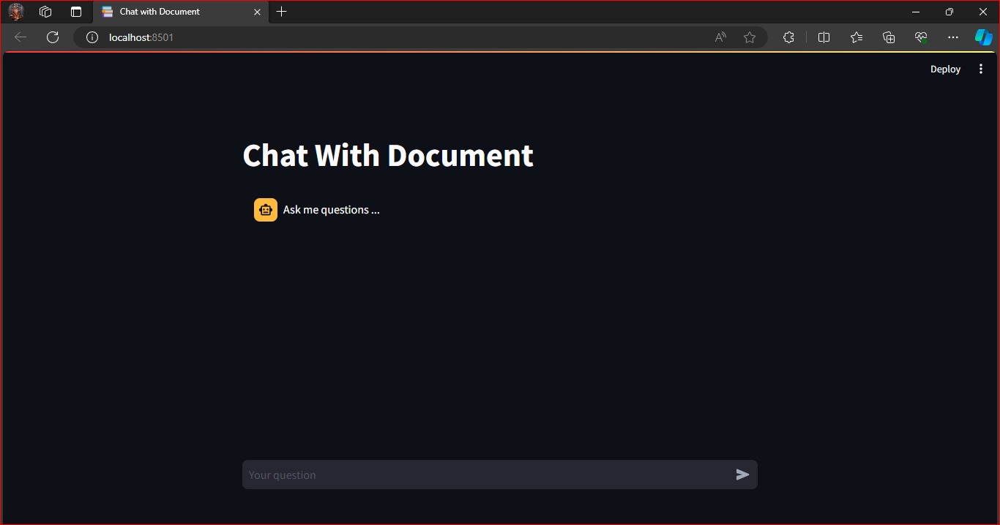
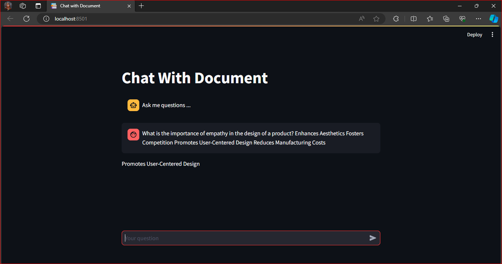

# Generative AI Workshop Projects

## Introduction
I attended the Generative AI workshop conducted by GeeksforGeeks-PDEU Club. During the workshop, I worked on three projects using the Gemini AI API by Google. To use the API, generate your API key from [Google AI](https://ai.google.dev/) and save it in the `.env` file for security.

## Setting up Virtual Environment
Follow the steps below to create a virtual environment for your project:

```bash
# Create a virtual environment
python -m venv venv

# Activate the virtual environment use Command Prompt
source venv/bin/activate  # for Linux or macOS
venv\Scripts\activate  # for Windows
```

# Project 1.1: Know about Person
## Description
The "Know about Person" project utilizes the Gemini AI API to gather information about a person. The Streamlit web app allows users to input the name of a famous person and retrieve details about their life, achievements, birth details, early life, interesting facts, imagined interview, fictional headline, and even a poem inspired by their legacy.





# Project 1.2: Know about Place
## Description
The "Know about Place" project uses the Gemini AI API to provide information about a famous place. The Streamlit web app allows users to input the name of a place and retrieve details such as why it's famous, nearest famous places, history, summary, a tour guide description, and even a short story or prose inspired by the beauty of the place.





# Project 2: Chat with Document

### Description
The "Chat with Document" project uses the Gemini AI API for conversational interactions based on the NPTEL video transcript data. The Streamlit web app enables users to engage in a chat-style conversation, asking questions about the document.

In this project, I have created a tool to assist with NPTEL assignments. I extracted data from NPTEL video transcripts and saved it in a text file. Using this data, I built a conversational AI system that allows users to ask questions related to the NPTEL content, aiding them in completing their assignments efficiently.




# Project 3.1: GAN-pytorch

## Description
This project demonstrates the implementation of a Generative Adversarial Network (GAN) using PyTorch. The GAN is trained on the MNIST dataset to generate synthetic images that resemble handwritten digits. The code is designed to run on Google Colab with a T4 GPU for optimal performance.

### Google Colab Setup
1. Open the Google Colab notebook using the provided link: [Google Collab](https://colab.research.google.com).

2. Make sure to select the T4 GPU for better performance in the Colab notebook.

<!--  -->


# Project 3.2: GenAI Workshop with Roop

## Description
This project demonstrates the usage of the Roop framework for face processing in images and videos. The code is executed in a Google Colab notebook to take advantage of the T4 GPU for better performance. The Roop framework provides various options for processing frames, including face swapping and face enhancement.

## Setup Instructions
1. Open the Google Colab notebook using the provided link: [Google Collab](https://colab.research.google.com).

2. Make sure to select the T4 GPU for better performance in the Colab notebook.

3. Execute the provided commands to clone the Roop repository, install necessary packages, and set up the environment.

4. Modify the command in the last code cell to customize the face processing options according to your requirements.

5. Don't forget to upload your video file and image (.jpg) file that contains face to change into the video and also change the file path.


